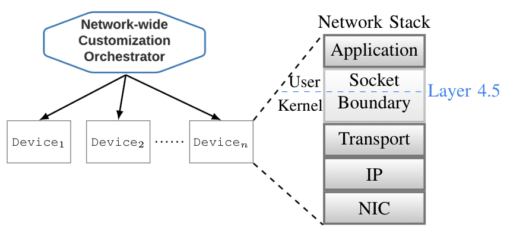
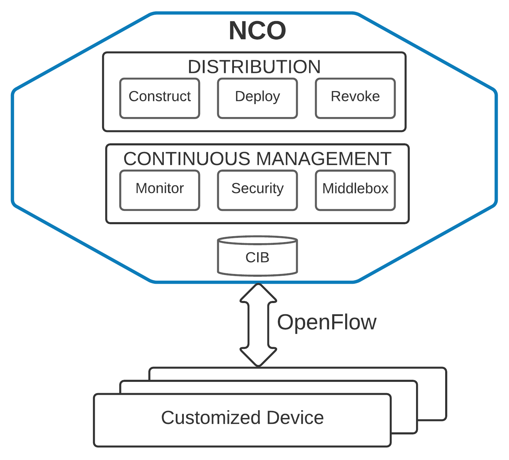
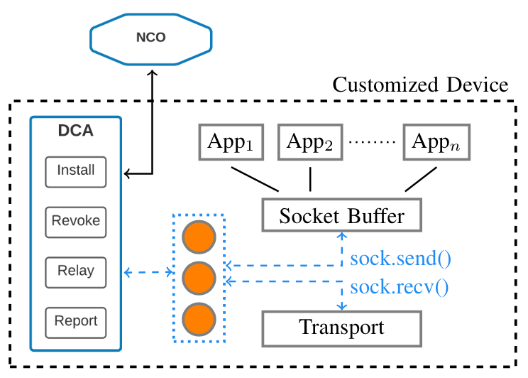

# Overview:

### Acronyms:

 - NCO: Network-wide Customization Orchestrator

 - DCA: Device Customization Agent

 -  CIB: Customization Information Base

1) NCO distributes customizations to devices over a control channel for insertion at Layer 4.5

- Layer 4.5 is transparent to application and transport layers

2) NCO has several internal components to support distribution and management of the deployed customization

- Construct: responsible for building the per-device customization module to include embedding necessary parameters and storing all values in the CIB

- Deploy: supports transport of customization modules, in binary format, to devices on the networ

- Revoke: support the removal of outdated or misbehaving customization modules from a customized device

- Monitor: allows for retrieving module use statistics across the network to aid in forensics analysis

- Security: provide a mechanism for adding per-network module security requirements to match a given threat model

- Middlebox: interface with network controlled middlebox device to allow processing a deployed customization

3) DCA establishes the control channel with NCO to manage customizations installed on the device.

-  DCA_user establishes the control channel with NCO

-  DCA_kernel encompasses Layer 4.5 logic to manage customizations on the device

4) Customization modules register with Layer 4.5 DCA

-  register the protocol (TCP or UDP), application (task) name, destination port, destination IPv4 address, source IPv4 address (if server), and source port (if desired) for tracking sockets

    -  server knows the source and dest IP since it binds to a source IP

    -  clients don't know source IP since IP table lookup has not happened yet

    -  source port (client) generally not useful since randomly assigned value

    -  destination port (server) generally not useful since randomly assigned by the client

-  provide send\_function and recv\_function pointers to be stored and
    applied to customized sockets

    -  the send or recv function may also be NULL if not customizing that path

    -  if both are NULL, then customization is rejected

## Branches
1. Buffering: introduces a different approach for receive side processing to allow the customization module to buffer L4 data for the application.  This basically allows processing for stricter applications, such as those that use TLS.

1. Rotating: introduces the capability to rotate customization modules on an active socket and maintain backward compatibility until both end points have same customization module active (i.e., due to transmission delays).
