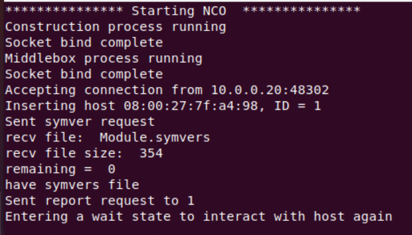
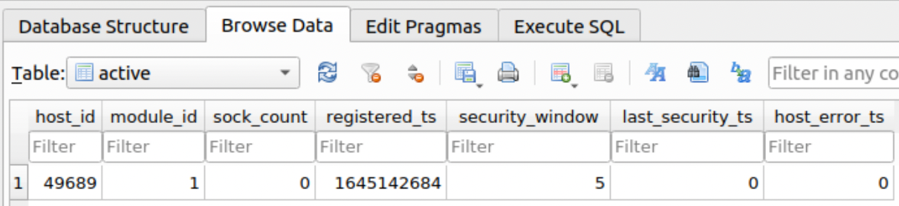
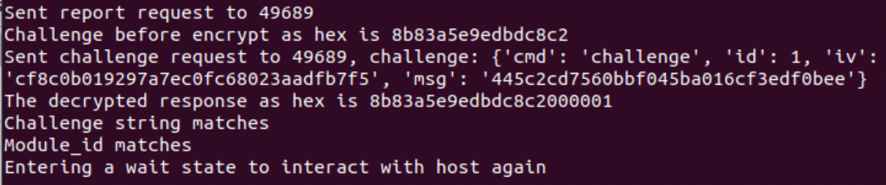
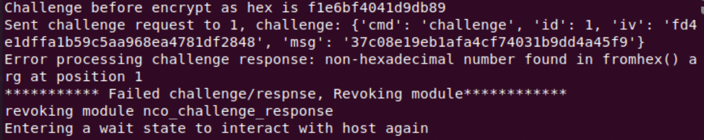
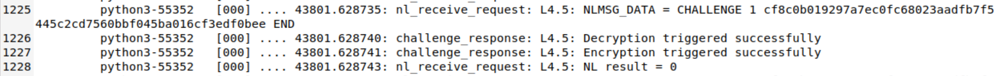
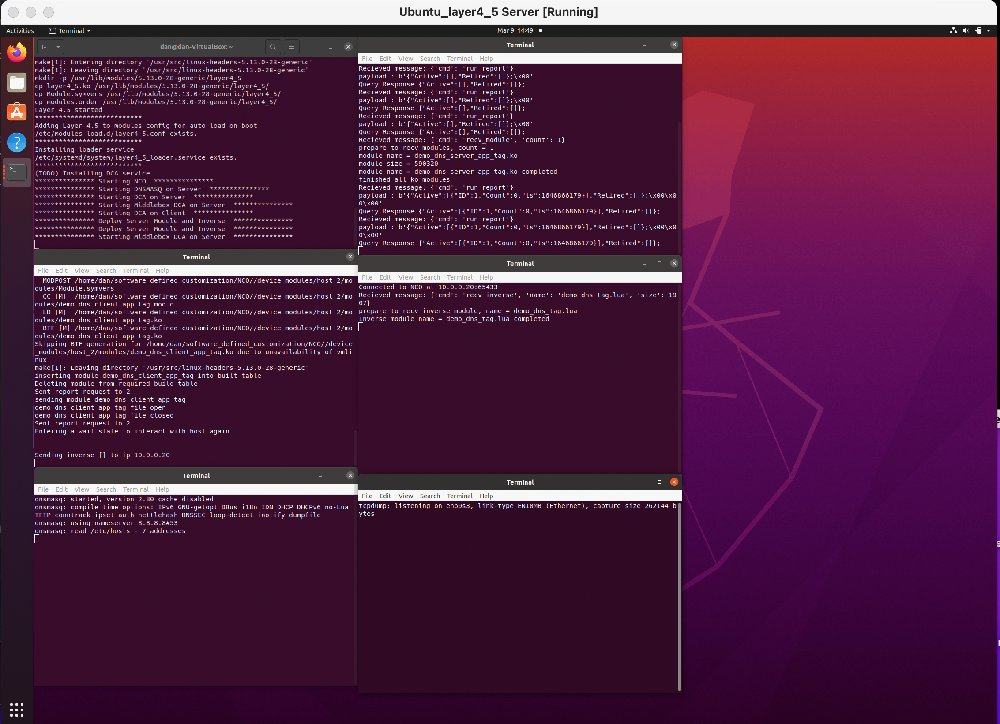
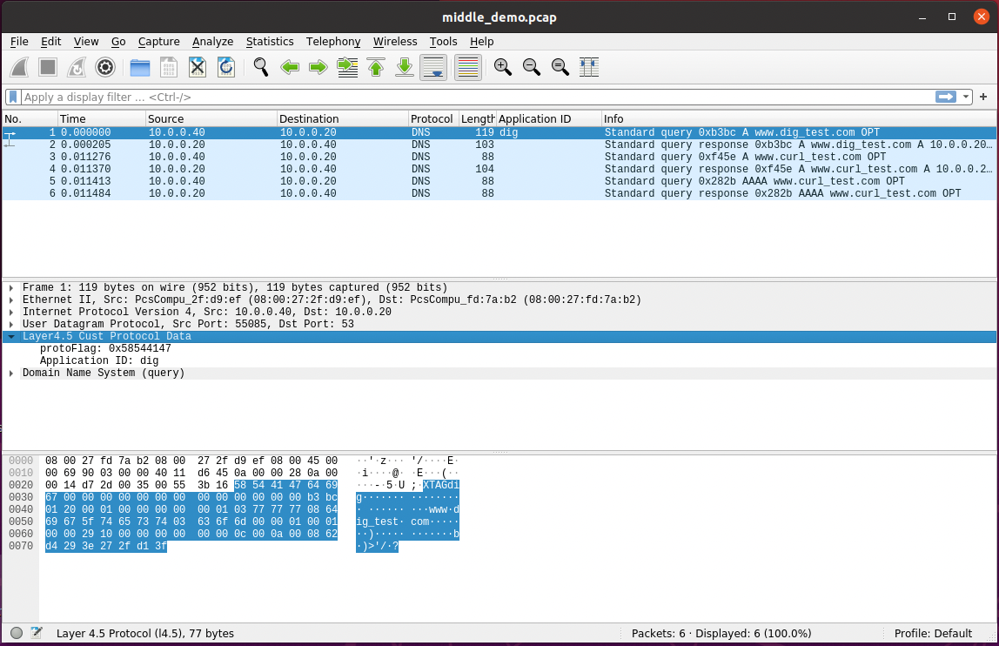

# Steps for repeating experiments from paper submission
{: .no_toc}
This page explains the steps to perform the experiments from the [NetSoft '22 paper](https://ieeexplore.ieee.org/abstract/document/9844104){:target="_blank"}.  


<details open markdown="block">
  <summary>
    Table of contents
  </summary>
  {: .text-delta }
1. TOC
{:toc}
</details>

## Prerequisites:

1. (OPTIONAL) Switch to the 'netsoft' branch to match the settings used in the paper.

1. To match the paper's experiments this requires 2 VM's running Layer 4.5 framework

     - The Vagrantfile creates a server and client VM with required packages installed.

1. Various aliases are used and are pre-installed on the Vagrant VM's

    - see setup.sh for VM aliases


## NCO/DCA overhead experiment:

Purpose: This experiment tests the overhead of distributing customizations unique to each host and the associated cost of managing the customization database.  


NOTE: This first trial of 250 hosts takes about 8 min to complete, mostly due to making a module to match each emulated host.  The complete test will take much longer, depending on the number of trials selected and build argument provided.

 - (SERVER)

     - ```bash
 cd ~/software_defined_customization/experiment_scripts/netsoft
    ```

 -  (SERVER) launch experiment script:

     - ```bash
./nco_dca_batch_experiment.sh 15 no
    ```

 - Arg1=Number of trials to perform
    - Paper experiment used 15 trials (time to complete = 1.5+ hours)
    - Recommend, 5 trials to save some time (time to complete ~ 30 min)
 - Arg2:
    - yes=modules are built for each host on first trial.  This greatly increases the experiment time.
    - no=modules only built for first trial of 250 hosts and reused for all other trials to save time.

 - View generated graph: nco_deploy.png


 - (SERVER) Cleanup steps:

     -  ```bash
cd ~/software_defined_customization/experiment_scripts/netsoft
        ```
     - ```bash
./cleanup.sh NCO
        ```

 - Copy tracelog to file and refresh:

     - ```bash
tracecopy nco_dca.txt
        ```
     - copies tracelog to ~/software_defined_customization folder


## Bulk file transfer overhead experiment:

Purpose: First we determine the overhead of adding in TCP network taps for Layer 4.5 customization, but do not apply any customization to the connection.  Then we determine the overhead of the taps with a sample customization applied to the connection that performs multiple memory copy operations.


 -  Copy a large test file to the NCO directory

     - The VM uses a shared folder so you don't need to copy the image to the VM since that will be accomplished by the bash script

     - The paper uses an Ubuntu.iso file (~3GB), but any large file will work.  

     - store the file as 'overhead.iso'


 - (CLIENT)
     - ```bash
cd ~/software_defined_customization/experiment_scripts/netsoft
    ```
 -  (CLIENT) Execute the bulk transfer script to perform all experiments and generate the graph:

     - Update script parameters to match your device:

        - SERVER_DIR=directory with overhead.iso


        - ```bash
sudo ./bulk_experiment.sh 15
        ```
        - Arg1=Number of trials to perform

            - Paper experiment used 15 trials (time to complete = 20+ min)

            - Recommend, 5 trials to save some time (time to complete ~ 7 min)


    - View generated graph: bulk_overhead.png


 - (CLIENT) Cleanup steps:

    - ```bash
cd ~/software_defined_customization/experiment_scripts/netsoft`
    ```
    - ```bash
./cleanup.sh BULK`
    ```


 -  Copy tracelog to file and refresh:

    - ```bash
tracecopy bulk_transfer.txt`
    ```
    - copies tracelog to ~/software_defined_customization folder


## Batch DNS overhead experiment:

Purpose: First we determine the overhead of adding in UDP network taps for Layer 4.5 customization, but do not apply any customization to the connection.  Then we determine the overhead of the taps with a sample customization applied to the connection that alters each message sent.


 > NOTE: during this experiment all DNS queries will result in the same IP address resolution, which makes normal internet usage not possible within the VM until experiment finishes.

 - (CLIENT)

     - ```bash 
cd ~/software_defined_customization/experiment_scripts/netsoft
    ```

 - (CLIENT) Execute the batch dns script to perform all experiments and generate the graph:

    - ```bash
sudo ./batch_experiment.sh 15 1000 0
    ```

        - arg1 = Number of trials

        - arg2 = Number of DNS requests in each trial

        - arg3 = Time between DNS requests

    - View generated graph: batch_overhead.png


 - (CLIENT) Cleanup steps:

     - ```bash
cd ~/software_defined_customization/experiment_scripts/netsoft
    ```
     - ```bash
./cleanup.sh BATCH
    ```

 - Copy tracelog to file and refresh:

    - ```bash
tracecopy batch_dns.txt
    ```
    - copies tracelog to ~/software_defined_customization folder


## Challenge/Response prototype:

Purpose: This demonstrates the ability to alter customization modules to include security code prior to building the modules.  Once deployed, the server can challenge the module based on the added code.


NOTE: The script assumes NCO and DCA are on same machine, but this is not a strict requirement and can be adapted to have them be different machines


 - (SERVER) Verify server VM has correct crypto driver present:

    - ```bash
cat /proc/crypto | grep cbc
    ```
        - Response should include: "driver: cbc-aes-aesni"

    - If correct driver not present, then update 'nco_challenge_response.c' with an aes-cbc driver present on your machine

        - location: software_defined_customization/NCO/core_modules

        - skcipher = crypto_alloc_skcipher("YOUR_AES_CBC_ALGO", 0, 0);

            - example: "cbc(aes)"


 - (SERVER) 
    - ```bash
cd ~/software_defined_customization/experiment_scripts/netsoft
    ```

 - (SERVER) Execute the shell script to conduct test:

    - ```bash
sudo ./challenge_response.sh 5 5 65
    ```
    - arg1 = security window

    - arg2 = query interval

    - arg3 = test runtime


 - Verify NCO and DCA are running in separate terminal windows

    - First message in terminal displays either NCO or DCA

 - Verify DCA connected to NCO

    


 - Verify challenge module deployed to DCA and challenge/response window set to 5 seconds

    - NOTE: scripted experiment DCA id will always be 1

    - Open cib.db with DB Browser for SQLite (already installed): 
    
        - ```bash
sqlitebrowser ~/software_defined_customization/NCO/cib.db
        ```

   

 - Allow script to run until completed

    - Verify each check passed via terminal output

   

   - If challenge/response fails, a message will be printed at NCO and module will be revoked

   

 - Verify each challenge/response was conducted correctly by reviewing tracelog entries

    - ```bash
tracelog
    ```

   

 - Terminate the DCA and NCO terminals when finished


 - (SERVER) Cleanup steps:

    - ```bash
cd ~/software_defined_customization/experiment_scripts/netsoft
    ```

    - ```bash
./cleanup.sh CHALLENGE
    ```

 - Copy tracelog to file and refresh:

    - ```bash
tracecopy chellenge_response.txt`
    ```

    - copies tracelog to ~/software_defined_customization folder


## Middlebox demo:

Purpose: This demonstrates that a customization module can have a corresponding inverse module deployed to a network middlebox conducting deep packet inspection in order to process the customization.

NOTE: this demo will assume the middlebox is on same machine as the DNS server


 - (SERVER) 
 
     - ```bash
cd ~/software_defined_customization/experiment_scripts/netsoft
    ```

 - (SERVER) Execute the shell script to conduct demo:

    - ```bash
sudo ./middle_demo.sh 10
    ```

    - arg1 = query interval


 - Verify server NCO, DCA, and middlebox DCA are running in separate terminal windows.  DNSMASQ and tcpdump will also be running in terminal windows.

    - NOTE: server DCA id will always be 1; client DCA id is 2

    

    - Top-left to Bottom-right:

        - shell script window

        - NCO

        - dnsmasq

        - server DCA

        - middlebox DCA

        - tcpdump

 - Verify all DCA's connected to NCO. Client DCA is host_id 2 and should show connected in NCO terminal also.

 - Verify demo modules deployed to server/client DCA and inverse module sent to middlebox DCA

 - Allow script to run until completed, signaled by Wireshark opening collected traffic packet.


 - Wireshark:

    - click on a DNS packet to see Layer 4.5 processing

        - reload lua plugins if not seeing app tags on DNS packets in next step

    - right click on Application ID field and add column to see in main view

        


 - (SERVER) Cleanup steps:

    - ```bash
cd ~/software_defined_customization/experiment_scripts/netsoft
    ```

    - ```bash
./cleanup.sh MIDDLEBOX
    ```

 - Copy tracelog to file and refresh:

    - ```bash
tracecopy middle_demo.txt
    ```

    - copies tracelog to ~/software_defined_customization folder

