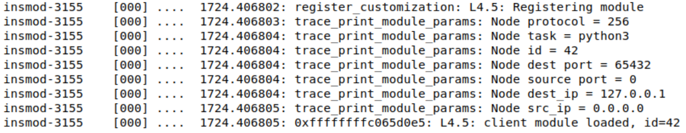
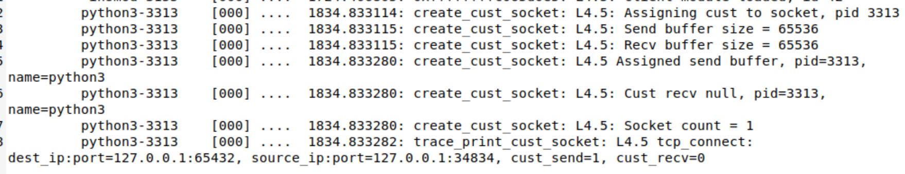
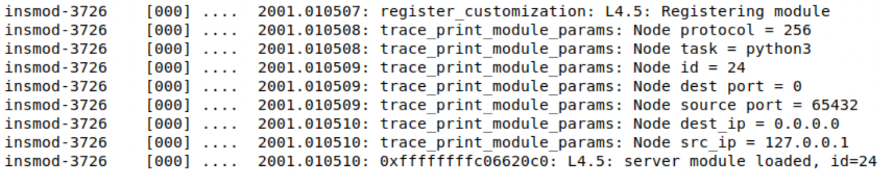
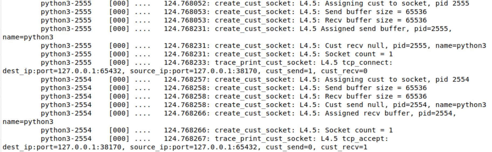

# Sample Customization Modules

> NOTE: This Guide only uses one of the Vagrant VM's created.  It does not matter which one you use (client or server)


Here we include sample modules to use with the Layer 4.5 installation.


 - sample\_python\_client: Inserts a tag to the front of the message sent to the server.

    - Example:

         - (Client) Hello

         - (Server) testCustModHello

     - Matches the flows:

       - source IP/port: \*/\*

       - dest IP/port: 127.0.0.1/65432

       - L4 protocol: TCP or UDP

       - Application: python3


 - sample\_python\_server: Removes the tag at the front of the message sent from the client.

     > NOTE: This module assumes the client module is loaded.  If loaded without the client module, then kernel may crash.

     - Example:

         - (Client) Hello

         - (Network) testCustModHello

         - (Server) Hello

     - Matches the flows:

       - source IP/port: 127.0.0.1/65432

       - dest IP/port: \*/\*

       - L4 protocol: TCP or UDP

       - Application: python3    


## Video walkthrough

 - [sample_walkthrough.mp4](../../assets/sample_walkthrough.mp4){:target="_blanl"}


## Steps to run a sample client only customization:

 -  All steps run on a single VM, either client or server VM will work

 -  ```bash
cd ~/software_defined_customization/layer4_5_modules/sample_modules
    ```

 -  Make the sample python client kernel module:

     - BUILD\_MODULE is command line arg to direct building a specific module

     - ```bash
make module=sample_python_client.o
    ```

         - verify no errors during module build


 -  Insert the client module:

     - ```bash
sudo insmod sample_python_client.ko
    ```

     - Verify client module loaded messages are present in trace log (/sys/kernel/tracing/trace)

         - ```bash
tracelog
        ```
       


 -  Launch the python echo client and server in two separate terminals and note the PID of each (printed in terminal):

     - Python code location (for reference): experiment_scripts/client\_server

     - ```bash
server_echo --tcp
    ```
     >  (- -udp)

     - ```bash 
client_echo --tcp
    ```
     > (- -udp)


 -  Type some messages into the echo client and verify the echo server receives
a modified message and replies with this modified message

     - Ex: Client - Hello; Server - testCustModHello


 -  In the client terminal, type 'quit' to close the connection

     - If using UDP, manually terminate the server


 -  dump the kernel trace file to find corresponding messages for layer 4.5 messages:

     - ```bash
tracelog
    ```
     - cust\_send=1 means send customization will be applied on the client

    


 -  remove the client module:

     - Skip if moving on to next section

     - ```bash
sudo rmmod sample_python_client
    ```

 -  reset the trace file between runs if desired

     - ```bash
cyclelog
    ```

## Steps to run sample client and server customizations:

 -  All steps run on a single VM, either client or server VM will work

 -  ```bash
cd ~/software_defined_customization/layer4_5_modules/sample_modules
```
 -  Make the sample python client and server kernel module:

     - BUILD\_MODULE is command line arg to direct building a specific module

     - ```bash
make module=sample_python_client.o
    ```
     -  ```bash
make module=sample_python_server.o
    ```
         - verify no errors during module build

         - if client was previously built, no need to rebuild it


 -  (Skip if client module still loaded) Insert client module:

     - ```bash
sudo insmod sample_python_client.ko
    ```
     - Verify client module loaded messages are present in trace log

         - ```bash
tracelog
        ```
        


 -  insert server modules:

     - ```bash
sudo insmod sample_python_server.ko
    ```

     - Verify client and server module loaded messages are present in trace log

         - ```bash
tracelog
        ```
        

 -  Launch the python echo client and server in two separate terminals and note the PID of each (printed in terminal):

     - Python code location: experiment_scripts/client\_server

     - ```bash
server_echo --tcp
    ```
     > (- -udp)

     - ```bash
client_echo --tcp
    ```
     > (- -udp)


 -  In a new terminal window, launch tcpdump to verify changes are applied to messages:

     - ```bash
sudo tcpdump port 65432 -i lo -X
    ```

     - alternatively, launch Wireshark and choose loopback interface


 -  type some messages into the echo client and verify tcpdump shows modified messages

     - echo client/server should show un-modified messages


 -  In the client terminal, type 'quit' to close the connection


 -  dump the kernel trace file to find corresponding messages for layer 4.5 messages:

     - ```bash
tracelog
    ```

     - cust\_send=1 means send customization will be applied on the client

     - cust\_recv=1 means recv customization will be applied on the server

    


 -  reset the trace file between runs if desired

     - ```bash
cyclelog
    ```


 -  Cleanup Steps:

     - ```bash
sudo rmmod sample_python_client
    ```
     - ```
sudo rmmod sample_python_server
    ```

     - ```bash
cd ~/software_defined_customization/layer4_5_modules/sample_modules
    ```

     - ```bash
make clean
    ```

 -  Copy tracelog to file and refresh:

     - ```bash
tracecopy FILENAME
    ```

     - copies tracelog to ~/software_defined_customization folder

