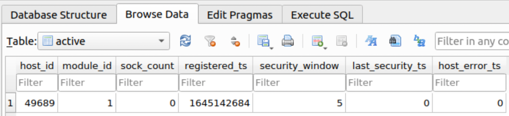
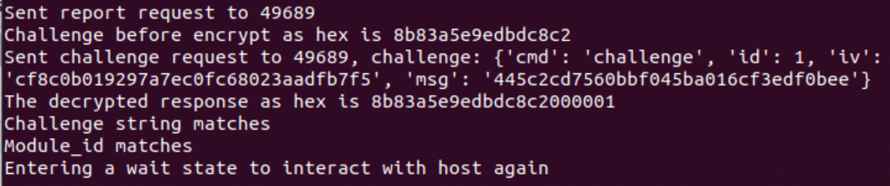
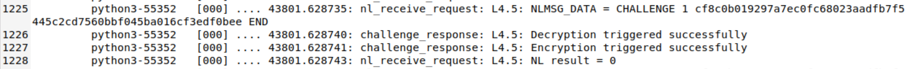
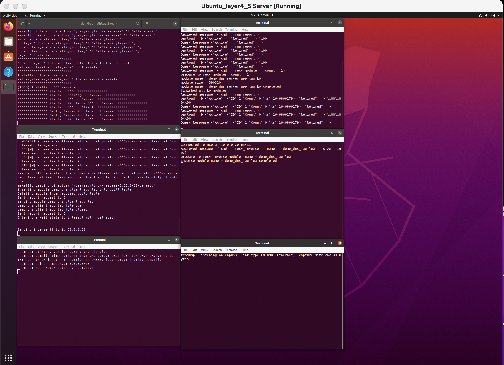
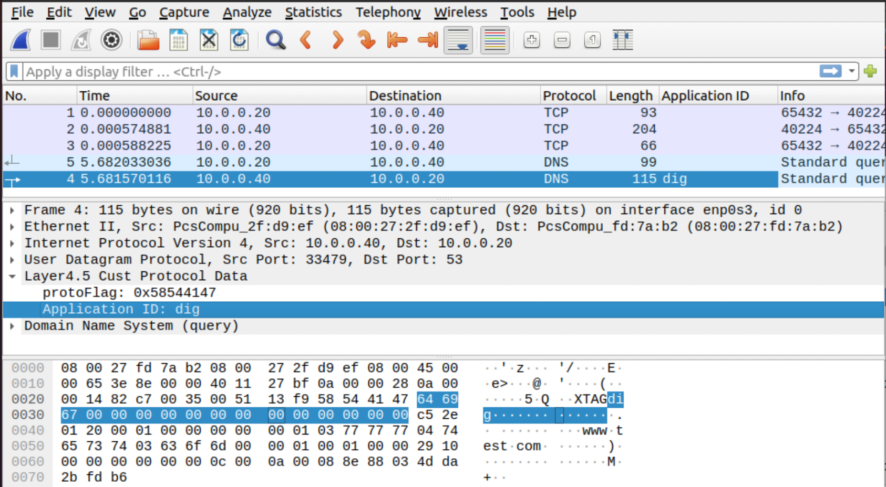

# Step for repeating experiments from paper submission

This README explains the steps to perform the experiments from the NetSoft '22 paper submission.  

NOTE: Paper will be uploaded to arxiv soon

## Prerequisites:

1) To match the paper's experiments this requires 2 VM's running Layer 4.5 framework

    * The Vagrantfile creates a server and client VM with required packages installed.

## NCO/DCA overhead experiment:

NOTE: This experiment takes a long time to complete, mostly due to making a module to match each emulated host for each trial.  I will eventually make a faster version to bypass repeated make operations as an option.

1) (SERVER) `cd software_defined_customization/experiment_scripts`

1) (SERVER) launch experiment script:

    * `./nco_dca_batch_experiment.sh 15`

        * this performs 15 trials for each number of hosts and plots results

        * modules are built for each host on first trial

1) View generated graph: nco_deploy.png

1) (SERVER) Cleanup steps:

    * `cd software_defined_customization/experiment_scripts`

    * `./cleanup.sh NCO`

## Bulk file transfer overhead experiment:

1) Copy a large test file to the NCO directory

    * The VM uses a shared folder so you don't need to copy the image to the VM

    * The paper uses an Ubuntu.iso file, but any large file will work.  For example, a copy of the Vagrant VM is fine

    * store the file as 'overhead.iso'

1) (CLIENT) `cd software_defined_customization/experiment_scripts`

1) (CLIENT) Execute the bulk transfer script to perform all experiments and
generate the graph:

    * Update script parameters to match your device:

        * SERVER_DIR=directory with overhead.iso

        * MD5=the md5sum of the overhead file

    * `sudo ./bulk_experiment.sh 15`

    * performs 15 trials

    * View generated graph: bulk_overhead.png

1) (CLIENT) Cleanup steps:

    * `cd software_defined_customization/experiment_scripts`

    * `./cleanup.sh BULK`

## Batch DNS overhead experiment:

NOTE: during this experiment all DNS queries will result in the same IP address resolution, which makes normal internet usage not possible within the VM until experiment finishes.

1) (CLIENT) `cd software_defined_customization/experiment_scripts`

1) (CLIENT) Execute the batch dns script to perform all experiments and
generate the graph:

    * `sudo ./batch_experiment.sh 15 1000 0`

        * performs 15 trials of 1000 DNS requests with 0 sec between each request

    * View generated graph: batch_overhead.png

1) (CLIENT) Cleanup steps:

    * `cd software_defined_customization/experiment_scripts`

    * `./cleanup.sh BATCH`

## Challenge/Response prototype:

NOTE: The script assumes NCO and DCA are on same machine, but this is not a strict requirement and can be adapted to have them be different machines

1) (SERVER) `cd software_defined_customization/experiment_scripts`

1) (SERVER) Execute the shell script to conduct test:

    * `sudo ./challenge\_response.sh 5 5 65`

    * arg1 = security window

    * arg2 = query interval

    * arg3 = test runtime

1) Verify NCO and DCA are running in separate terminal windows

1) Verify DCA connected to NCO

1) Verify challenge module deployed to DCA and challenge/response window set to 5 seconds

    * NOTE: scripted experiment DCA id will always be 1

   

1) Allow script to run until completed

    * Verify each check passed via terminal output

   

1) Verify each challenge/response was conducted correctly by reviewing
tracelog entries

   

1) Terminate the DCA and NCO terminals when finished

1) (SERVER) Cleanup steps:

    * `cd software_defined_customization/experiment_scripts`

    * `./cleanup.sh CHALLENGE`

## Middlebox demo:

NOTE: this demo will assume the middlebox is on same machine as the DNS server

1) (SERVER) `cd software_defined_customization/experiment_scripts`

1) (SERVER) Execute the shell script to conduct demo:

    * `sudo ./middle\_demo.sh 10`

    * arg1 = query interval

1) Verify server NCO, DCA, and middlebox DCA are running in separate terminal windows.  DNSMASQ and tcpdump will also be running in terminal windows.

    * NOTE: server DCA id will always be 1; client DCA id is 2

    

    * Top-left to Bottom-right:

        * shell script window

        * NCO

        * dnsmasq

        * server DCA

        * middlebox DCA

        * tcpdump

1) Verify all DCA's connected to NCO. Client DCA is host_id 2 and should show connected in NCO terminal also.

1) Verify demo modules deployed to server/client DCA and invervse module sent to middlebox DCA

1) Allow script to run until completed, signaled by Wireshark opening collected traffic packet.

    * dnsmasq terminal will stay open for verification that dns queries were made

1) Wireshark:

    * click on a DNS packet to see Layer 4.5 processing

        * reload lua plugins if not seeing app tags on DNS packets in next step

    * right click on Application ID field and add column to see in main view

        

1) (SERVER) Cleanup steps:

    * `cd software_defined_customization/experiment_scripts`

    * `./cleanup.sh MIDDLEBOX`
