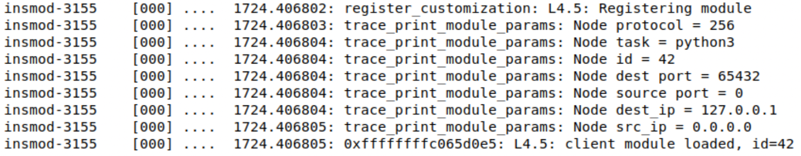
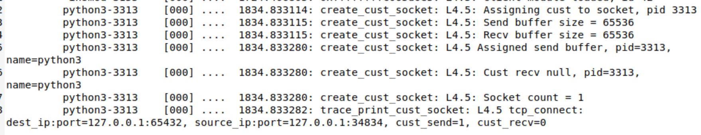
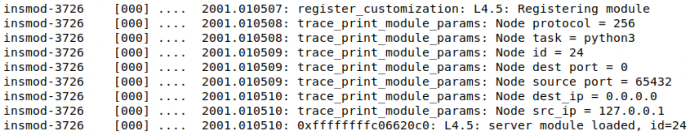
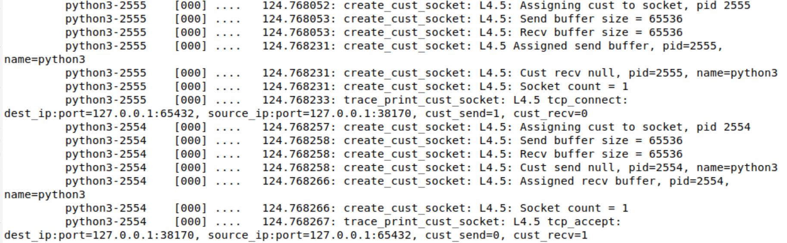

# Sample Customization Modules

Here we include sample modules to use with the Layer 4.5 installation.

## Steps to run a sample client only customization:

1) Make the sample python client kernel module:

    * Modify Makefile in this folder to adjust path variables

        * GIT_LOCATION must be updated to reflect your folder path

        * BUILD\_MODULE is command line arg to direct building a specific module

    * run 'make BUILD\_MODULE=sample\_python\_client.o'

        * verify no errors during module build

1) Insert the client module:

    * sudo insmod sample\_python\_client.ko

    * Verify client module loaded messages are present in trace log

        * /sys/kernel/tracing/trace

        * 

1) Launch the python echo client and server in two separate terminals:

    * /test\_scripts/client\_server

    * python3 echo\_server.py --tcp (--udp)

    * python3 echo\_client.py --tcp (--udp)

1) If desired to help read trace log file, in another terminal, grep for process id's
 of target customization: pgrep python3

1) Type some messages into the echo client and verify the echo server receives
a modified message and replies with this modified message

1) type 'quit' to close client connection, which may also terminate the server
(otherwise terminate the server)

1) dump the kernel trace file to find corresponding messages for layer 4.5 messages:

    * sudo gedit /sys/kernel/tracing/trace

    * 

        * cust\_send=1 means send customization will be applied on the client

1) reset the trace file between runs if desired (as root, sudo su): > /sys/kernel/tracing/trace

1) remove the client module: sudo rmmod sample\_python\_client

### Steps to run sample client and server customizations:

1) In the test\_modules folder, make and install sample python kernel modules:

    * Modify Makefile in this folder to adjust path variables

        * GIT_LOCATION must be updated to reflect your folder path

        * BUILD\_MODULE is command line arg to direct building a specific module

    * run 'make BUILD\_MODULE=sample\_python\_client.o' and 'make BUILD\_MODULE=sample\_python\_server.o'

        * verify no errors during module build

        * if client was previously built, no need to rebuild it

    * insert client and server modules:

        * sudo insmod sample\_python\_client.ko

        * sudo insmod sample\_python\_server.ko

        * Verify client and server module loaded messages are present in trace log

            * /sys/kernel/tracing/trace

            * 

            * 

1) Launch the python echo client and server in two separate terminals:

    * /test\_scripts/client\_server

    * python3 echo\_server.py --proto tcp (udp)

    * python3 echo\_client.py --proto tcp (udp)

1) In a new terminal window, launch tcpdump to verify changes are applied to messages:

    * sudo tcpdump -i any -X

    * alternatively, launch Wireshark    

1) type some messages into the echo client and verify tcpdump shows modified messages

    * echo client/server should show un-modified messages

1) type 'quit' to close client connection, which may also terminate the server
(otherwise terminate the server)

1) dump the kernel trace file to find corresponding messages for layer 4.5 messages:

    * sudo gedit /sys/kernel/tracing/trace

    * 

        * cust\_send=1 means send customization will be applied on the client

        * cust\_recv=1 means recv customization will be applied on the server

1) reset the trace file between runs if desired (as root, sudo su): > /sys/kernel/tracing/trace

1) remove the client/server module:

    * sudo rmmod sample\_python\_client

    * sudo rmmod sample\_python\_server
